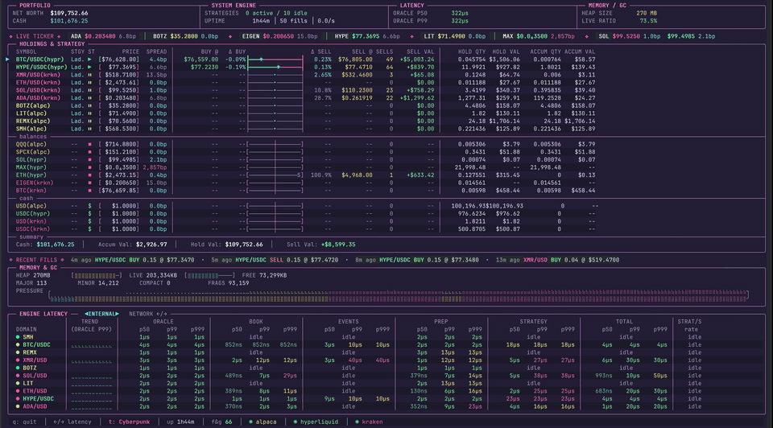

# dio-domains

dio is an OCaml 5 trading engine. Trading behaviour is defined by **strategy
files**, not compiled code: the engine loads a strategy, validates it, and runs
it over a registered library of actions. The strategy it ships — the
**Jacobs Ladder** grid, which buys dips and sells into reversals — runs against
Kraken, Hyperliquid, Lighter, Interactive Brokers, and Alpaca.

Each traded asset runs in its own OCaml domain. Order intents funnel through a
lock-free executor, market data lands in lock-free ring buffers, and a
**capital-survival oracle** sizes each position from the asset's all-time
drawdown history. A terminal dashboard attaches to the running engine over a
Unix domain socket.

[](https://github.com/malciller/dio-domains/actions/workflows/ci.yml)
[](https://github.com/malciller/dio-domains/releases)
[](https://github.com/malciller/dio-domains/stargazers)
[](https://hub.docker.com/r/malciller/dio-domains)
[](https://ocaml.org)
[](LICENSE)

> **This trades real money.** It comes with no warranty. Test on a testnet
> before risking capital.



> Like it? [Star the repo](https://github.com/malciller/dio-domains/stargazers)
> so more people find it. [Watch releases](https://github.com/malciller/dio-domains/releases)
> to see what's next. Bugs and ideas go in the issue tracker.

## Quick start

New to this? The [deployment guide](https://diophantsolutions.com/dio/DEPLOYMENT/)
is a step-by-step walkthrough: make a folder, pull the image, extract the starter
files, and fill in `config.json` and `.env`. The short version:

The image ships the example config, env template, and compose file. Pull them
out first (no repository clone needed). It is published to both GitHub Container
Registry (`ghcr.io/malciller/dio-domains`) and Docker Hub
(`malciller/dio-domains`); the commands below use GHCR — substitute the Docker
Hub name if you prefer:

```sh
IMAGE=ghcr.io/malciller/dio-domains:latest
docker pull $IMAGE
docker run --rm -v "$PWD:/out" --entrypoint cp $IMAGE /usr/share/doc/dio/config.example.json /out/config.json
docker run --rm -v "$PWD:/out" --entrypoint cp $IMAGE /usr/share/doc/dio/.env.example /out/.env
docker run --rm -v "$PWD:/out" --entrypoint cp $IMAGE /usr/share/doc/dio/compose.yaml /out/compose.yaml
# edit config.json and .env for your venues and instruments

docker compose up -d                 # start the engine
docker compose run --rm dashboard    # attach the dashboard (Ctrl-p Ctrl-q to detach)
```

The published image is `linux/amd64`. On Apple Silicon it runs under emulation.
The engine reads `config.json` and `.env` from the working directory and writes
state to the `dio-data` volume.

Full reference: [configuration](https://diophantsolutions.com/dio/CONFIGURATION/)
and [deployment](https://diophantsolutions.com/dio/DEPLOYMENT/).

## Executables

| Executable | Function |
| --- | --- |
| `dio` | The engine. Trades the instruments in `config.json`. |
| `dio-dashboard` | Terminal UI. Connects to a running engine over the Unix domain socket. |
| `dio-oracle` | Runs the sizing pipeline offline and prints the decision surface. |

## Strategy files

A strategy is a file, not compiled code. Each entry in `config.json` names one
(`"strategy": "jacobs_ladder"`); the engine loads `strategies/<name>.strategy`,
validates it, and compiles it to the internal step/action representation at
startup. The script is a small, dotted language (also accepts `.json`, the
compiled form) with no braces or significant whitespace in names:

```
when book.updates:
  skip.nan.price:
    if $platform.price.nan:
      stop
```

`dio strategy validate <file>` checks a strategy statically and
`dio strategy compile <file.strategy>` emits its JSON form. See the
[strategy script guide](https://diophantsolutions.com/dio/STRATEGY/) for the
language and the action vocabulary.

## Documentation

All documentation lives at **<https://diophantsolutions.com/dio/>**:
[deployment](https://diophantsolutions.com/dio/DEPLOYMENT/),
[configuration](https://diophantsolutions.com/dio/CONFIGURATION/),
[strategy scripts](https://diophantsolutions.com/dio/STRATEGY/),
[capital oracle](https://diophantsolutions.com/dio/ORACLE/),
[risk and terms](https://diophantsolutions.com/dio/RISK/), and the
[specification](https://diophantsolutions.com/dio/SPEC/).

## Support

Bug reports and feature requests go through GitHub issues:
<https://github.com/malciller/dio-domains/issues>. There is no email or chat
support. Never paste API keys or other secrets into an issue.

## License

MIT. See [LICENSE](LICENSE).
